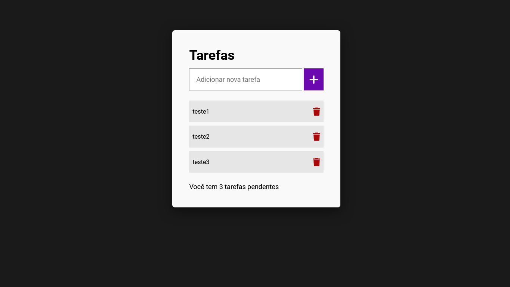

<h1 align=" center"> 
    Todo list 📖
</h1>

<h1>
    
</h1>

<h2 align="center">
    <a href="https://matheusnlourenco.github.io/project-todolist-js/">See the Project</a>
</h2>
<h2>🚨 about</h2>

project from a simple task manager, where you can add or remove your tasks.

<h2>🔨 Tools</h2>

- HTML
- SASS/CSS
- JAVASCRIPT
